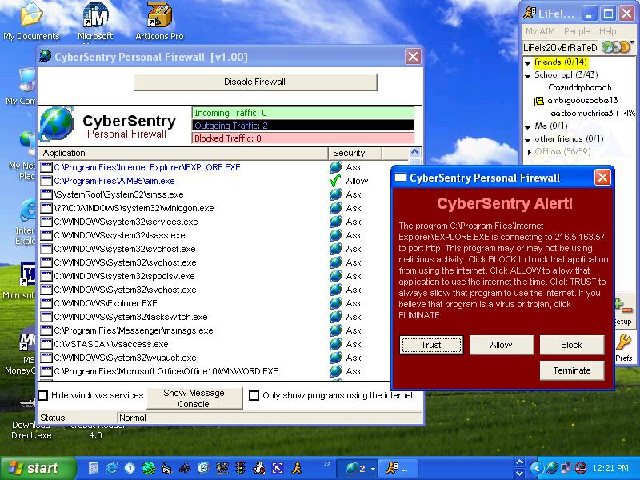



## Real VB Firewall \- UPDATED

### Description

REAL WORKING FIREWALL IN VB6! Logs applications to allow or block just like a professional grade firewall. It temporarily suspends the application until you make a choice. It can terminate programs you think are trojans. Overall, the most complete firewall ever in vb6. This is the beta version, the full version is currently under construction. Hopefully i posted all of the code this time!!!
 
### More Info
 

             |
---                |---
**Submitted On**   |2003-06-07 20:48:22
**By**             |[Insomnia Software](https://github.com/Planet-Source-Code/PSCIndex/blob/master/ByAuthor/insomnia-software.md)
**Level**          |Advanced
**User Rating**    |1.5 (17 globes from 11 users)
**Compatibility**  |VB 5\.0, VB 6\.0
**Category**       |[Internet/ HTML](https://github.com/Planet-Source-Code/PSCIndex/blob/master/ByCategory/internet-html__1-34.md)
**World**          |[Visual Basic](https://github.com/Planet-Source-Code/PSCIndex/blob/master/ByWorld/visual-basic.md)
**Archive File**   |[Real\_VB\_Fi159811672003\.zip](https://github.com/Planet-Source-Code/insomnia-software-real-vb-firewall-updated__1-46037/archive/master.zip)

